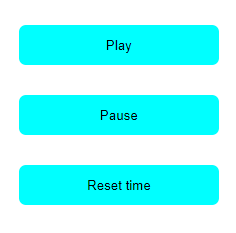

# Sax gandalf with websocket

## Setup

### Node modules
- websocket

### Change server url in client.js and ctrl.js
`const serverUrl = "ws://127.0.0.1:8081";`

---

## Website

### Sax gnadalf

Important: You need to interact with the website (click on the website), otherwise javascript can't play a video.

### Controller

You can play and pause the video and set the time to 0. If the videos are out of sync, it can help to press "reset time"

---
## © Max Lohrmann